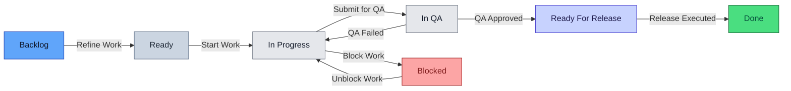

# **Documento 03 – Atlas de Flujos y Máquina de Estados (JPDS)**

## **Generalidades**

### **Propósito del Documento**

- Definir de manera **oficial y única** los flujos de estados y transiciones.
- Estandarizar reglas de automatización sin afectar métricas.
- Garantizar que las métricas reflejen **realidad operativa**, no comportamiento artificial del sistema.
- Servir como referencia para:
  - Onboarding
  - Auditorías internas
  - Toma de decisiones ejecutivas
  - Mejora continua del proceso

---

---
### **Convención Canónica de Estados (Workflow JPDS)**

La siguiente tabla define la **convención oficial y universal** de estados utilizada en el  
**Jira Product Development System (JPDS)**.

Estos estados constituyen el **lenguaje común del sistema** y son los **únicos válidos**
para medición, dashboards ejecutivos y análisis de flujo.

> **Regla Canónica:**  
> Todos los workflows, independientemente de su especialización (Backend, Frontend, Design, Database, QA),
> deben mapear sus estados internos a **una y solo una** de estas categorías.

---

| Categoría Semántica | Estado Canónico | Fondo (HEX) | Texto (HEX) | Ejemplo Visual | Uso Semántico |
|--------------------|----------------|-------------|-------------|----------------|--------------|
| **Initial** | **Backlog** | `#60A5FA` | `#0F172A` | Backlog | Trabajo identificado pero no ejecutable. |
| **Ready / Queue** | **Ready** | `#CBD5E1` | `#1F2937` | Ready | Cola de trabajo lista para ejecución. |
| **Active Work** | **In Progress** | `#E5E7EB` | `#111827` | In Progress | Trabajo activo productivo. |
| **Quality Gate** | **In Review** | `#E5E7EB` | `#111827` | In Review | Revisión o validación previa. |
| **Quality Gate** | **In QA** | `#E5E7EB` | `#111827` | In QA | Aseguramiento de calidad. |
| **Waiting** | **Waiting** | `#C7D2FE` | `#1E1B4B` | Waiting | Espera conocida y gestionada. |
| **Blocked** | **Blocked** | `#FCA5A5` | `#7F1D1D` | Blocked | Impedimento incierto que requiere escalamiento. |
| **Done** | **Done** | `#4ADE80` | `#064E3B` | Done | Valor entregado. |
| **Cancelled** | **Cancelled** | `#D1D5DB` | `#374151` | Cancelled | Trabajo descartado. |

---

## **Estados Especializados Permitidos (Post-Estandarización)**

Los siguientes estados **siguen existiendo**, pero **no son canónicos**.  
Todos deben mapearse explícitamente.

### **Ejecución Técnica / Producto**

| Estado Especializado | Categoría Canónica |
|--------------------|-------------------|
| UI | In Progress |
| Service Integration | In Progress |
| Prototyping | In Progress |
| In Design | In Progress |
| In Code Review | In Review |
| Validation | In Review |
| Testing | In Review |
| Ready For QA | Ready |
| Ready For Release | Waiting |

---

### **Dependencias y Excepciones**

| Estado Especializado | Categoría Canónica |
|--------------------|-------------------|
| Waiting | Waiting |
| Blocked | Blocked |
| Live (Campaign) | Done |

---

## **Estados Eliminados**

- Ready Dev  
- QA Pending  
- In Code / In Coding  
- Duplicated Backlogs  
- Hybrid / ambiguous states

---

> **Contrato JPDS**  
> Los estados canónicos definen cómo el sistema mide.  
> Los estados especializados definen cómo el equipo trabaja.  
> Nunca se mezclan.

## **Notas Canónicas de Gobierno**

- ❌ No se permiten estados fuera de esta convención.
- ❌ No se crean métricas usando estados especializados.
- ✅ Los tableros de disciplina pueden usar especialización.
- ✅ Todo estado especializado **debe tener mapeo documentado**.
- 🔁 Cambiar esta tabla requiere:
  - Revisión de arquitectura  
  - Versionado del JPDS  
  - Aprobación de gobierno  

> **Este catálogo es el contrato semántico del JPDS.  
Define cómo el sistema piensa, mide y aprende.**

### **Principios Generales del Sistema (JPDS)**

1. **El flujo debe ser simple para el equipo y robusto para el sistema**  
   El equipo ejecuta acciones naturales orientadas al trabajo real.  
   El sistema es responsable de mantener coherencia, trazabilidad y consistencia métrica.

2. **Las métricas nunca deben ser forzadas ni simuladas**  
   Ninguna automatización, acción programada o intervención manual debe iniciar, detener o alterar métricas de manera artificial.

3. **Modelo de responsabilidad y medición por niveles**  
   El sistema adopta un modelo explícito de tres niveles:
   - **Nivel 1 (Gobiernan):** Definen intención, alcance y prioridad. No generan métricas de tiempo operativo.
   - **Nivel 2 (Miden):** Son la unidad oficial de medición de flujo, tiempo y calidad funcional.
   - **Nivel 3 (Definen):** Representan la ejecución técnica real y permiten medir fricción, calidad técnica y eficiencia operativa.

4. **Todo estado debe tener significado semántico real y único**  
   Cada estado representa una condición operativa concreta.  
   No existen estados decorativos, redundantes o ambiguos.

5. **Dependencias y bloqueos son conceptos distintos y medibles**  
   - Las dependencias representan esperas conocidas y gestionadas.
   - Los bloqueos representan impedimentos reales, inciertos y fuera del control del equipo.
   Ambos se miden y analizan de forma independiente.

---

### **Reglas Generales de Métricas**

Las métricas del sistema se rigen por las siguientes reglas estrictas:

- Se calculan exclusivamente a partir de timestamps reales de estado.
- No se disparan por:
  - Automatizaciones
  - Cambios masivos
  - Actualizaciones programadas
- No se calculan a nivel Epic.
- Se miden únicamente a nivel:
  - Story
  - Bug
  - Task (cuando aplique)

---

### **Principios de Medición de Tiempo**

| Principio | Definición |
|---------|------------|
| Single Source of Truth | El estado define el tiempo, no la acción del usuario |
| Start on Work | El tiempo inicia únicamente cuando el trabajo realmente comienza |
| Stop on Completion | El tiempo termina al entregar valor validado |
| Explicit Block | Todo bloqueo debe declararse explícitamente |
| No Retroactivity | Las métricas no se ajustan manualmente ni de forma retroactiva |

---

### **Relación entre Estados y Métricas**

- In Progress inicia el Cycle Time.
- Blocked acumula Blocked Time.
- In QA mide Time in QA.
- Done cierra el Cycle Time.
- Waiting mide tiempos de espera sin penalizar productividad.

---

### **Principios de Automatización**

Las automatizaciones cumplen únicamente funciones de soporte al sistema:

- Mantener coherencia visual y de flujo.
- Registrar eventos de forma automática.
- Habilitar métricas confiables.
- Reducir carga operativa del equipo.

Las automatizaciones nunca deben:
- Bloquear transiciones manuales.
- Modificar estados críticos de forma irreversible.
- Alterar métricas de tiempo o calidad.

---

### **Alcance de la Documentación**

Este documento aplica a:

- Todos los proyectos gestionados bajo JPDS.
- Todos los equipos involucrados (Desarrollo, QA, Diseño, Producto).
- Todos los tableros y workflows derivados del sistema.

Cualquier excepción debe:
- Estar documentada formalmente.
- Contar con aprobación explícita.
- Mantener compatibilidad métrica con el sistema base.

---

### **Nota de Gobierno**

> La calidad del sistema no se mide por la cantidad de reglas,  
> sino por la confianza que generan sus métricas.

---
---
---

## NIVEL 1 – ESTRATÉGICO

### **1. Epic (Nivel 1)**

#### **Purpose**
> *Strategic container. Defines macro direction, scope and long-term intent.  
An Epic does **not** represent direct execution; it aggregates value delivered through Stories.*

---

#### **State Flow**
~~~mermaid
graph LR
    Backlog -->|Start Work| InProgress[In Progress]
    InProgress -->|Complete Work| Done

    style Backlog fill:#60A5FA,stroke:#1E40AF,color:#0F172A
    style InProgress fill:#E5E7EB,stroke:#6B7280,color:#111827
    style Done fill:#4ADE80,stroke:#166534,color:#064E3B
~~~

---

#### **State Semantics**

| State | Semantic Category | Meaning |
|-----|-------------------|---------|
| Backlog | Initial | Epic identified and approved at strategy level, but with no active execution |
| In Progress | Active Work | At least one child Story is being actively worked on |
| Done | Done | All child Stories completed and value fully delivered |

---

#### **Transition Rules**

> *Epics move exclusively based on the aggregated state of their child Stories.  
No manual execution or operational work is performed at Epic level.*

| From → To | Transition | Condition | Required Field |
|---------|------------|----------|----------------|
| Backlog → In Progress | Start Work | At least one child Story enters **In Progress** | N/A |
| In Progress → Done | Complete Work | 100% of child Stories are in **Done** | N/A |

---

#### **Automations**

> *Epic automations are strictly visual and strategic.  
They never block, override or alter Story-level workflows.*

| Rule | Trigger | Result |
|-----|--------|--------|
| Auto Start Epic | Any child Story enters **In Progress** | Epic → **In Progress** |
| Auto Complete Epic | All child Stories enter **Done** | Epic → **Done** |

---

#### **Mandatory Fields**

| Field | Purpose |
|-----|--------|
| Summary | Strategic initiative name |
| Description | Business intent, scope and high-level goals |
| Owner | Strategic owner or sponsor |
| Target Outcome | Expected value or impact |

---

#### **Key Metrics**

> *Epics do not generate operational execution metrics.  
They function as strategic aggregators and observation points.*

##### **Time**

| Metric | Measures |
|------|---------|
| Epic Lead Time (Optional) | Total lifespan of the Epic |
| Start Delay | Time from Epic creation to first Story start |

##### **Flow**

| Metric | Meaning |
|------|--------|
| Stories per Epic | Actual size and scope |
| Epic Throughput | Epics completed per period |
| Epic Aging | Epics open beyond expected horizon |

##### **Quality**

| Metric | Indicator |
|------|-----------|
| Reopened Stories | Poor strategic definition or unclear scope |
| Spillover Stories | Epic underestimation or fragmentation |

##### **Code**

> *Epics have no direct linkage to code metrics.  
All technical traceability lives at Story and Sub-task levels.*

---

> **Governance Notes**
> - Epics **do not participate** in Cycle Time, Flow Efficiency or WIP.
> - Epics are not used for estimation or time tracking.
> - Manual state changes are discouraged; automation is the source of truth.
> - The role of an Epic is **strategic alignment**, not execution control.
> - All delivery metrics are calculated at **Story and Sub-task** levels.

---
---
---

## NIVEL 2 – VALOR Y GESTIÓN

### **2. User Story (Nivel 2)**

#### **Purpose**
> *Functional value delivered to the end user.  
Acts as the execution anchor for all Sub-tasks and technical work.*

---

#### **State Flow**

---

#### **State Semantics**

| State | Semantic Category | Meaning |
|-----|-------------------|---------|
| Backlog | Initial | Story identified but not yet refined or executable |
| Ready | Ready / Queue | Story refined, clear and ready to be worked |
| In Progress | Active Work | Development and implementation in progress |
| In QA | Quality Gate | Functional and technical validation by QA |
| Ready For Release |Waiting | QA approved, waiting for release execution |
| Blocked | Blocked | Impediment without clear resolution or ETA |
| Done | Done | User value delivered and validated |

---

#### **Transition Rules**

> *Stories advance only when clarity, quality and validation criteria are met.  
Transitions never bypass quality gates.*

| From → To | Transition | Condition | Required Field |
|---------|------------|----------|----------------|
| Backlog → Ready | Refine Work | Story is understandable and scoped | Description |
| Ready → In Progress | Start Work | Refinement completed | Acceptance Criteria |
| In Progress → In QA | Submit for QA | Development completed | PR Link / Evidence |
| In QA → Done | Approve QA | QA approved | QA Result |
| In Progress → Blocked | Block Work | Impediment detected | Block Reason |
| Blocked → In Progress | Unblock Work | Impediment resolved | N/A |

---

#### **Automations**

> *Automations enhance traceability and consistency.  
They never block manual actions or team decisions.*

| Rule | Trigger | Result |
|-----|--------|--------|
| Auto QA | All Sub-tasks in Done | Story → In QA |
| Block Start | Enter Blocked | Set Blocked Start |
| Block End | Exit Blocked | Set Blocked End |
| QA Start Date | Enter In QA | Set QA Start Date |
| Done Date | Enter Done | Set Done Date |

---

#### **Mandatory Fields**

| Field | Purpose |
|-----|--------|
| Summary | Clear description of user value |
| Description | Functional context and scope |
| Acceptance Criteria | Definition of correct behavior |
| Priority | Business importance |

---

#### **Key Metrics**

> *Story metrics represent real delivery performance.  
All metrics are calculated using real timestamps.*

##### **Time**

| Metric | Measures |
|------|---------|
| Cycle Time | In Progress → Done |
| QA Time | Time in In QA |
| Blocked Time | Time accumulated in Blocked |
| Waiting Time | Time in waiting-related states |

##### **Flow**

| Metric | Meaning |
|------|--------|
| Throughput | Stories completed per period |
| WIP | Concurrent stories in progress |
| Flow Efficiency | % of productive vs total time |

##### **Quality**

| Metric | Indicator |
|------|-----------|
| Bugs per Story | Development quality |
| Reopen Rate | QA effectiveness |
| QA Loopbacks | Rework frequency |

##### **Code**

| Metric | Source |
|------|--------|
| PR Size | GitHub |
| Review Time | GitHub |
| Commits | GitHub |
| Files Changed | GitHub |

---

> **Governance Notes**
> - Stories **do participate** in Cycle Time, WIP and Flow Efficiency.
> - Stories never bypass QA.
> - All execution metrics are derived from Sub-task activity.
> - Epic state and automations do not affect Story metrics.

---
---

### **3. Campaign (Nivel 2)**

#### **Purpose**
> *Temporary business or marketing initiative.  
Coordinates planning, preparation, activation and closure of promotions or commercial actions.  
Does **not** represent direct technical execution; all execution lives in linked Issues and Sub-tasks.*

---

#### **State Flow**
~~~mermaid
graph LR
    Backlog -->|Start Work| InPreparation[In Preparation]
    InPreparation -->|Ready for Execution| Ready[Ready]
    Ready -->|Start Work| Live
    Live -->|Complete Work| Done

    style Backlog fill:#60A5FA,stroke:#1E40AF,color:#0F172A
    style InPreparation fill:#E5E7EB,stroke:#6B7280,color:#111827
    style Ready fill:#CBD5E1,stroke:#64748B,color:#1F2937
    style Live fill:#E5E7EB,stroke:#6B7280,color:#111827
    style Done fill:#4ADE80,stroke:#166534,color:#064E3B
~~~

---

#### **State Semantics**

| State | Semantic Category | Meaning |
|-----|-------------------|---------|
| Backlog | Initial | Campaign defined at business level, not yet prepared |
| In Preparation | Active Work | Planning and preparation activities in progress (assets, configuration, coordination) |
| Ready | Ready / Queue | Campaign fully prepared and validated, waiting for activation |
| Live | Active Work | Campaign active in production or market |
| Done | Done | Campaign ended and deactivated |

---

#### **Transition Rules**

> *Campaigns do not execute technical work.  
Their progress depends on linked Issues status and business dates.*

| From → To | Transition | Condition | Required Field |
|---------|------------|----------|----------------|
| Backlog → In Preparation | Start Work | At least one linked Issue starts execution | N/A |
| In Preparation → Ready | Ready for Execution | 100% of linked Issues are Done | N/A |
| Ready → Live | Start Work | Campaign start date reached | Start Date |
| Live → Done | Complete Work | Campaign end date reached | End Date |

---

#### **Automations**

> *Automations synchronize state, dates and business visibility.  
They never create or block technical work.*

| Rule | Trigger | Result |
|-----|--------|--------|
| Auto Start Preparation | First linked Issue enters In Progress | Campaign → In Preparation |
| Auto Ready for Execution | All linked Issues enter Done | Campaign → Ready |
| Auto Launch Campaign | Start Date reached | Campaign → Live |
| Auto Complete Campaign | End Date reached | Campaign → Done |

---

#### **Mandatory Fields**

| Field | Purpose |
|-----|--------|
| Summary | Campaign name |
| Description | Business context and objective |
| Start Date | Activation date |
| End Date | Deactivation date |
| Target Audience | Intended user segment |
| Success Metrics | Business KPIs |

---

#### **Key Metrics**

> *Campaign metrics measure coordination, timing and business effectiveness,  
not technical effort or development speed.*

##### **Time**

| Metric | Measures |
|------|---------|
| Campaign Lead Time | Backlog → Done |
| Preparation Time | Time in In Preparation |
| Live Duration | Time in Live |

##### **Flow**

| Metric | Meaning |
|------|--------|
| Issues per Campaign | Required execution effort |
| Campaign Throughput | Campaigns completed per period |
| On-Time Launch Rate | Campaigns launched on schedule |

##### **Quality**

| Metric | Indicator |
|------|-----------|
| Last-Minute Changes | Poor preparation or late decisions |
| Reopened Issues | Execution instability |
| Post-Campaign Fixes | Production issues detected during Live |

##### **Code**

> *Campaigns have no direct linkage to code metrics.  
All technical metrics live at Issue and Sub-task levels.*

---

> **Governance Notes**
> - Campaigns **do have business states** (Live), unlike Epics.
> - No technical work is allowed while in Live.
> - Any change during Live requires a new Issue or Task.
> - Campaign metrics are business-oriented and never mixed with delivery metrics.

---

### **4. Bug (Nivel 2)**

#### **Purpose**
> *Functional or technical defect with learning intent.  
A Bug exists to restore quality, identify root causes and prevent recurrence.  
It represents system improvement, not just error correction.*

---

#### **State Flow**
~~~mermaid
graph LR
    Backlog -->|Start Triage| Ready[Ready]
    Ready -->|Start Work| InProgress[In Progress]
    InProgress -->|Submit for Review| InReview[In Review]
    InReview -->|Approve Review| ReadyQA[Ready For QA]
    ReadyQA -->|Start QA| InQA[In QA]
    InQA -->|Complete Work| Done

    InProgress -->|Block Work| Blocked
    Blocked -->|Unblock Work| InProgress

    InReview -->|Request Changes| InProgress
    Backlog -->|Cancel Work| Cancelled

    style Backlog fill:#60A5FA,stroke:#1E40AF,color:#0F172A
    style Ready fill:#CBD5E1,stroke:#64748B,color:#1F2937
    style InProgress fill:#E5E7EB,stroke:#6B7280,color:#111827
    style InReview fill:#E5E7EB,stroke:#6B7280,color:#111827
    style ReadyQA fill:#CBD5E1,stroke:#64748B,color:#1F2937
    style InQA fill:#E5E7EB,stroke:#6B7280,color:#111827
    style Done fill:#4ADE80,stroke:#166534,color:#064E3B
    style Blocked fill:#FCA5A5,stroke:#991B1B,color:#7F1D1D
    style Cancelled fill:#D1D5DB,stroke:#4B5563,color:#374151
~~~

---

#### **State Semantics**

| State | Semantic Category | Meaning |
|-----|-------------------|---------|
| Backlog | Initial | Bug reported but not yet analyzed |
| Ready | Ready / Queue | Triage completed, root cause direction defined |
| In Progress | Active Work | Fix implementation in progress |
| In Review | Active Work | Code review or validation in progress |
| Ready For QA | Ready / Queue | Fix approved and ready for QA |
| In QA | Quality Gate | Verification and regression testing |
| Blocked | Blocked | Fix cannot proceed due to unresolved impediment |
| Done | Done | Bug fixed, validated and closed |
| Cancelled | Terminal | Bug invalid, duplicated or not reproducible |

---

#### **Bug Types in the System**

| Level | Type | Correct Usage |
|-----|------|---------------|
| Level 2 | Bug | Cross-cutting, systemic or unscoped defect |
| Level 3 | Bug Sub-task | Localized defect tied to a specific Story or Task |

> **Golden Rule:**  
> If the affected Story is known → **Bug Sub-task (Level 3)**  
> If impact is transversal or unclear → **Bug (Level 2)**, but **never left attached to an Epic without follow-up analysis**.

---

#### **Mandatory Fields**

| Field | Purpose |
|-----|--------|
| Summary | Clear identification of the defect |
| Environment | Where the bug occurred (Prod, QA, Dev) |
| Detected By | Source of detection |
| Reproduction Steps | Reproducibility |
| Expected Result | Correct behavior |
| Actual Result | Observed behavior |
| Severity | Technical impact |
| Root Cause | True origin of the issue |
| CAPA | Corrective and preventive action |

---

#### **Transition Rules**

> *A Bug never advances without understanding the problem and documenting learning.*

| From → To | Transition | Condition | Required Field |
|---------|------------|----------|----------------|
| Backlog → Ready | Start Triage | Triage completed | Severity |
| Ready → In Progress | Start Work | Fix approach defined | Root Cause |
| In Progress → In Review | Submit for Review | Fix implemented | PR Link |
| In Review → Ready For QA | Approve Review | Review approved | Review Approval |
| Ready For QA → In QA | Start QA | QA execution started | N/A |
| In QA → Done | Complete Work | QA approved | CAPA |

---

#### **Automations**

> *Automations ensure traceability of time, quality and learning.*

| Rule | Trigger | Result |
|-----|--------|--------|
| Block Start | Enter Blocked | Set Blocked Start |
| Block End | Exit Blocked | Set Blocked End |
| QA Start Date | Enter In QA | Set QA Start Date |
| Done Date | Enter Done | Set Done Date |
| Reopen Tracking | Reopen Bug | Increment Reopen Counter |

---

#### **Key Metrics**

> *Bugs are the primary input for continuous improvement.*

---

##### **Accountability**

| Metric | Answers |
|------|--------|
| Bugs by Detected By | Who detects most defects |
| Bugs Introduced By | Where defects originate |
| Bugs per Area | Area with higher incidence |
| Bugs per Severity | Systemic risk level |

---

##### **Time**

| Metric | Measures |
|------|---------|
| Bug Cycle Time | In Progress → Done |
| Triage Time | Backlog → Ready |
| Fix Time | Ready → In Review |
| QA Time | In QA → Done |
| Blocked Time | Time accumulated in Blocked |

---

##### **Flow**

| Metric | Meaning |
|------|--------|
| Bug Throughput | Bugs closed per period |
| Reopen Rate | Bugs reopened |
| Bug Aging | Bugs open too long |
| Flow Efficiency | % of productive time |

---

##### **Quality**

| Metric | Indicator |
|------|-----------|
| Root Cause Distribution | Systemic failure patterns |
| CAPA Coverage | % of bugs with prevention |
| Repeat Bugs | Recurring defects |
| Escaped Bugs | Bugs reaching production |

---

##### **Code**

| Metric | Source |
|------|--------|
| PR Size | GitHub |
| Review Time | GitHub |
| Commits per Bug | GitHub |
| Files Changed | GitHub |
| Bug Density | Bugs per module or LOC |

---

#### **Systemic Learning**

> *Every Bug must leave the system better than before.*

| Element | Usage |
|------|------|
| Root Cause | Improve process or architecture |
| CAPA | Prevent recurrence |
| Trends | Prioritize refactors |
| Insights | Adjust Definition of Done |

---

> **Governance Notes**
> - A Bug is **not normal work**; it is a system signal.
> - A Bug without Root Cause and CAPA is **organizational debt**.
> - JPDS improves more through Bugs than through new Features.
> - The goal is not to close Bugs fast, but to **never see them again**.

---
---
---

### **5. Database (Nivel 2)**

#### **Purpose**
> *Definition, design and controlled evolution of data persistence (schema and data).  
Centralizes data intent for an Epic or group of Stories and provides full traceability for DBA operations:
design → validation → implementation → review.*

---

#### **State Flow**
~~~mermaid
graph LR
    Backlog -->|Start Work| InDesign[In Design]
    InDesign -->|Submit for Review| Prototyping[Prototyping]
    Prototyping -->|Start Development| InCode[In Code]
    InCode -->|Submit for Review| InReview[In Review]
    InReview -->|Complete Work| Done

    InReview -->|Return to Development| Prototyping

    style Backlog fill:#60A5FA,stroke:#1E40AF,color:#0F172A
    style InDesign fill:#E5E7EB,stroke:#6B7280,color:#111827
    style Prototyping fill:#E5E7EB,stroke:#6B7280,color:#111827
    style InCode fill:#E5E7EB,stroke:#6B7280,color:#111827
    style InReview fill:#E5E7EB,stroke:#6B7280,color:#111827
    style Done fill:#4ADE80,stroke:#166534,color:#064E3B
~~~

---

#### **State Semantics**

| State | Semantic Category | Meaning |
|-----|-------------------|---------|
| Backlog | Initial | Data change identified but not yet executable |
| In Design | Active Work | Logical data model definition and impact analysis |
| Prototyping | Active Work | Validation of schema, queries, constraints and approach |
| In Code | Active Work | Technical implementation: migrations, scripts, adapters |
| In Review | Quality Gate | DBA / architecture review and approval |
| Done | Done | Data change approved and completed |

---

#### **Transition Rules**

> *Database Issues define the data contract of the system and therefore require strict discipline.*

| From → To | Transition | Condition | Required Field |
|---------|------------|----------|----------------|
| Backlog → In Design | Start Work | Data intent is understood | Description |
| In Design → Prototyping | Submit for Review | Logical model ready | Description |
| Prototyping → In Code | Start Development | Prototype validated | Evidence / Notes |
| In Code → In Review | Submit for Review | Migration scripts or PR exist | Link PR |
| In Review → Done | Complete Work | Final approval granted | Approval Checklist |
| In Review → Prototyping | Return to Development | Model must be revised | N/A |

---

#### **Automations**

> *Automations never block work. They only improve traceability and metrics accuracy.*

| Rule | Trigger | Result |
|-----|--------|--------|
| Design Start Date | Enter In Design | Set Design Start |
| Prototype Start Date | Enter Prototyping | Set Prototype Start |
| Code Start Date | Enter In Code | Set Code Start |
| Review Start Date | Enter In Review | Set Review Start |
| Done Date | Enter Done | Set Done Date |
| Rework Counter | Return to Development | Increment Rework Counter |

---

#### **Mandatory Fields**

| Field | Purpose |
|-----|--------|
| Summary | Clear description of the DB change |
| Description | Data model, entities and types |
| Microservice | Impacted service (if applicable) |
| Migration Plan | Step-by-step execution plan |
| Rollback Plan | Reversion strategy |
| Backward Compatibility | Impact on existing consumers |

---

#### **Key Metrics**

##### **Time**

| Metric | Measures |
|------|---------|
| DB Lead Time | Backlog → Done |
| Design Time | Time in In Design |
| Prototype Time | Time in Prototyping |
| Implementation Time | Time in In Code |
| Review Time | Time in In Review |
| Rework Time | Time caused by returns to Prototyping |

##### **Flow**

| Metric | Meaning |
|------|--------|
| DB Throughput | Completed DB changes per period |
| DB WIP | Concurrent DB changes |
| Rework Rate | % of changes returned from review |

##### **Quality**

| Metric | Indicator |
|------|----------|
| Migration Incidents | Production issues caused by DB changes |
| Rollback Rate | Changes that required rollback |
| Performance Regression | Negative performance impact |

##### **Code**

| Metric | Source |
|------|--------|
| PR Review Time | GitHub |
| Files / Scripts Changed | GitHub |
| Migration Size | GitHub diff |

---

> **Governance Notes**
> - Database Issues define the persistence contract of the system.
> - No destructive change is allowed without a Rollback Plan.
> - Specialized DB Sub-tasks may exist at Level 3, but all strategic intent lives here.
> - Metrics are calculated by **semantic category**, not by state name.

### **6. Task (Nivel 2)**

#### **Purpose**
> *Tactical and executable work, usually reactive or operational.  
Its value is internal, regulatory or time-sensitive, and does not require user narrative.*

---

#### **Mandatory Classification**

> *Every Task must be classified for control, audit and metrics.*

**Required Field:** `Task Category` (Cascading Select)

**Level 1**
- Operational
- Compliance
- Reactive

**Level 2**
- Operational: Reports, Configuration, Support, Data
- Compliance: CNBV, Legal, Audit, Disclaimers
- Reactive: Urgent Change, Operational Hotfix, Off-roadmap Adjustment

---

#### **State Flow**
~~~mermaid
graph LR
    Backlog -->|Refine Work| Ready
    Ready -->|Start Work| InProgress[In Progress]
    InProgress -->|Wait for Dependency| Waiting
    Waiting -->|Resume Work| InProgress
    InProgress -->|Submit for Validation| Validation
    Validation -->|Approve Work| Done

    style Backlog fill:#60A5FA,stroke:#1E40AF,color:#0F172A
    style Ready fill:#CBD5E1,stroke:#64748B,color:#1F2937
    style InProgress fill:#E5E7EB,stroke:#6B7280,color:#111827
    style Waiting fill:#C7D2FE,stroke:#4338CA,color:#1E1B4B
    style Validation fill:#E5E7EB,stroke:#6B7280,color:#111827
    style Done fill:#4ADE80,stroke:#166534,color:#064E3B
~~~

---

#### **State Semantics**

| State | Semantic Category | Meaning |
|-----|-------------------|---------|
| Backlog | Initial | Task identified but not yet actionable |
| Ready | Ready / Queue | Task clear, categorized and prioritized |
| In Progress | Active Work | Task execution in progress |
| Waiting | Dependency | Waiting for known external input |
| Validation | Quality Gate | Generic validation or approval |
| Done | Done | Task completed and validated |

---

#### **Transition Rules**

> *Tasks advance by operational clarity and availability of information.  
They do not require user narrative, but do require full context.*

| From → To | Transition | Condition | Required Field |
|---------|------------|----------|----------------|
| Backlog → Ready | Refine Work | Context sufficient to execute | Description |
| Ready → In Progress | Start Work | Task categorized and prioritized | Task Category |
| In Progress → Waiting | Wait for Dependency | External dependency identified | Waiting Reason |
| Waiting → In Progress | Resume Work | Dependency resolved | N/A |
| In Progress → Validation | Submit for Validation | Work completed | Evidence / Link |
| Validation → Done | Approve Work | Validation approved | Validation Result |

---

#### **Automations**

> *Automations enable traceability and metrics.  
They never block manual actions.*

| Rule | Trigger | Result |
|-----|--------|--------|
| Start Date | Enter In Progress | Set Start Date |
| Waiting Start | Enter Waiting | Set Waiting Start |
| Waiting End | Exit Waiting | Set Waiting End |
| Validation Date | Enter Validation | Set Validation Date |
| Done Date | Enter Done | Set Done Date |

---

#### **Mandatory Fields**

| Field | Purpose |
|-----|--------|
| Summary | Clear task identification |
| Description | Operational context |
| Task Category | Classification and reporting |
| Priority | Execution urgency |
| Validation Result | Approval outcome |

---

#### **Key Metrics**

> *Task metrics are operational, not product-level.*

---

##### **Time**

| Metric | Measures |
|------|---------|
| Cycle Time | Ready → Done |
| Lead Time | Backlog → Done |
| Waiting Time | Time accumulated in Waiting |
| Validation Time | Validation → Done |

---

##### **Flow**

| Metric | Meaning |
|------|--------|
| Tasks Completed | Tasks closed per period |
| Tasks by Category | Operational load distribution |
| SLA Compliance | Compliance and reactive tasks on time |
| Task Aging | Tasks open beyond acceptable time |

---

##### **Quality**

| Metric | Indicator |
|------|-----------|
| Validation Rejections | Issues found in validation |
| Rework Rate | Post-validation rework |
| Missed SLA | Operational or regulatory risk |

---

##### **Code**

> *Tasks may or may not have direct technical impact.  
When they do, traceability lives in Sub-tasks and repositories.*

| Metric | Source |
|------|--------|
| PR Size | GitHub |
| Review Time | GitHub |
| Commits | GitHub |

---

> **Governance Notes**
> - All Tasks **must pass Validation** as a generic QA gate.
> - Tasks **do generate metrics**, but they are **operational**, not product metrics.
> - Recurrent Tasks must be created **one per period** (e.g. monthly).
> - Real execution effort lives in **Sub-tasks**, not in the Task itself.
> - Task metrics must **never be mixed** with Story or Product metrics.

---
---

### **7. Coordination (Nivel 2)**

#### **Purpose**
> *Living entity for technical and operational governance.  
Manages, documents and centralizes integrations and dependencies with third parties.  
Does **not** represent direct user value nor functional execution.*

---

#### **General Description**

> *Coordination acts as the technical–operational record of an external provider or dependency.  
It lives beyond Epics, Stories and Tasks, and serves as the single source of truth for audit, operation and continuity.*

---

#### **Relationship With Other Work Types**

- **Epics / Stories**: Consume the integration
- **Tasks**: Execute specific changes or maintenance
- **Coordination**: Documents, governs and evaluates the integration state

> *A Coordination may be related to multiple Epics, Stories and Tasks over time.*

---

#### **Mandatory Fields**

> *Every Coordination must contain minimum information to guarantee traceability, operation and auditability.*

| Field | Type | Purpose |
|-----|------|---------|
| Provider Name | Text | External provider or dependency name |
| Integration Type | Select | API, VPN, File Exchange, Messaging, Identity, Financial |
| Domain / Area | Select | Onboarding, KYC, Payments, Compliance, Notifications |
| Status | Select | Active, Degraded, Inactive, Deprecated |
| Environment | Multi-select | Sandbox, QA, Production |
| Documentation URL | URL | Official provider documentation |
| Technical Contact | Text | Provider technical contact |
| Business Owner | User | Internal accountable owner |
| SLA Defined | Boolean | Indicates if formal SLA exists |
| Last Review Date | Date | Last technical or operational review |
| Risk Level | Select | Low, Medium, High |

---

#### **State Flow**

> *Coordination states reflect integration health and lifecycle,  
not execution or delivery progress.*

~~~mermaid
graph LR
    Active -->|Incident Detected| Degraded
    Degraded -->|Issue Resolved| Active
    Active -->|Temporarily Disabled| Inactive
    Inactive -->|Reactivated| Active
    Active -->|Planned Replacement| Deprecated

    style Active fill:#4ADE80,stroke:#166534,color:#064E3B
    style Degraded fill:#FCA5A5,stroke:#991B1B,color:#7F1D1D
    style Inactive fill:#E5E7EB,stroke:#6B7280,color:#111827
    style Deprecated fill:#FCD34D,stroke:#92400E,color:#78350F
~~~

---

#### **State Semantics**

| State | Semantic Category | Meaning |
|-----|-------------------|---------|
| Active | Active (Healthy) | Integration operating normally |
| Degraded | Degraded | Service partially unavailable or unstable |
| Inactive | Inactive | Temporarily disabled by decision |
| Deprecated | Deprecated | Planned retirement or replacement |

---

#### **Transition Rules**

> *Transitions represent operational decisions or external events,  
never development execution.*

| From → To | Transition | Condition | Required Field |
|---------|------------|----------|----------------|
| Active → Degraded | Incident Detected | Degradation or incident occurs | Incident Reference |
| Degraded → Active | Issue Resolved | Incident resolved | Resolution Evidence |
| Active → Inactive | Temporarily Disabled | Business or technical decision | Reason |
| Inactive → Active | Reactivated | Integration restored | N/A |
| Active → Deprecated | Planned Replacement | Replacement plan approved | Replacement Plan |

---

#### **Automations**

> *Automations ensure historical traceability without interfering with operation.*

| Rule | Trigger | Result |
|-----|--------|--------|
| Status Change Log | Any status change | Append status history |
| Review Reminder | Review cadence reached | Notify Business Owner |
| Degraded Alert | Enter Degraded | Notify stakeholders |
| Deprecated Flag | Enter Deprecated | Mark integration as non-usable |

---

#### **Key Metrics**

---

##### **Integration Health**

| Metric | Measures |
|------|---------|
| Active Uptime | Time spent in Active |
| Degraded Frequency | Incidents per period |
| Time to Recovery | Degraded → Active |
| Deprecated Count | Obsolete integrations |

---

##### **Risk and Dependency**

| Metric | Meaning |
|------|--------|
| High-Risk Integrations | Operational exposure |
| Single Points of Failure | Critical dependencies |
| SLA Breaches | Provider non-compliance |

---

##### **Related Execution**

> *Coordination does not execute work directly.  
Execution is tracked through related Epics, Stories and Tasks.*

| Metric | Source |
|------|--------|
| Related Epics | Jira |
| Related Stories | Jira |
| Related Tasks | Jira |

---

> **Governance Notes**
> - Coordinations **are not closed**; they are living entities.
> - They do **not** generate Cycle Time, WIP or delivery metrics.
> - They contain **no user features or logic**.
> - All execution must live in **Story or Task**, only referenced here.
> - Coordination is the authoritative source for **audit, continuity and risk management**.

---
---
---
## NIVEL 3 – EJECUCIÓN

## **Nivel 3 – Sub-tasks (Unidad Operativa del JPDS)**

> *Las Sub-tasks representan el trabajo real.  
Si algo consume tiempo, genera esfuerzo o riesgo técnico, debe existir aquí.*

---

## **Principios Generales**

- Toda Sub-task **pertenece a un Issue Nivel 2** (Story, Bug, Database, Campaign, etc.)
- Las métricas oficiales del sistema **nacen aquí**
- Cada especialidad tiene su **workflow optimizado**, pero **métricas consistentes**
- Ninguna Sub-task se cierra sin cumplir su **Definition of Done**

---

# **Tipos de Sub-task**

---

## **1. Backend Sub-task [BE] (Nivel 3)**

#### **Purpose**
> *Implement business logic, APIs, services, integrations and system rules.*

---

#### **Mandatory Fields**

| Field | Purpose |
|------|---------|
| Summary | What will be built |
| Description | Technical implementation detail |
| Expected Behavior | Expected functional output |
| Validations | Business rules and error handling |
| Tech Considerations | Technical decisions and constraints |
| Definition of Done | Minimum quality bar |
| PR Link | Traceability to code review |
| QA Result | Validation outcome |

---

#### **State Flow**
~~~mermaid
graph LR
    Backlog -->|Ready for Execution| Ready[Ready]
    Ready -->|Start Work| InProgress[In Progress]
    InProgress -->|Submit for Review| InReview[In Review]
    InReview -->|Approve Review| ReadyQA[Ready For QA]
    ReadyQA -->|Start QA| InQA[In QA]
    InQA -->|Complete Work| Done

    InProgress -->|Block Work| Blocked
    Blocked -->|Unblock Work| InProgress

    InReview -->|Request Changes| InProgress

    style Backlog fill:#60A5FA,stroke:#1E40AF,color:#0F172A
    style Ready fill:#CBD5E1,stroke:#64748B,color:#1F2937
    style InProgress fill:#E5E7EB,stroke:#6B7280,color:#111827
    style InReview fill:#E5E7EB,stroke:#6B7280,color:#111827
    style ReadyQA fill:#CBD5E1,stroke:#64748B,color:#1F2937
    style InQA fill:#E5E7EB,stroke:#6B7280,color:#111827
    style Done fill:#4ADE80,stroke:#166534,color:#064E3B
    style Blocked fill:#FCA5A5,stroke:#991B1B,color:#7F1D1D
~~~

---

#### **State Semantics**

| State | Semantic Category | Meaning |
|-----|-------------------|---------|
| Backlog | Initial | Work identified but not yet ready |
| Ready | Ready / Queue | Fully defined and ready to start |
| In Progress | Active Work | Implementation in progress |
| In Review | Quality Gate | Code review in progress |
| Ready For QA | Ready / Queue | Approved and queued for QA |
| In QA | Quality Gate | QA execution and validation |
| Blocked | Blocked | Impediment without clear ETA |
| Done | Done | Completed and validated |

---

#### **Transition Rules**

> *Backend Sub-tasks must remain fully traceable to code and validation artifacts.*

| From → To | Transition | Condition | Required Field |
|---------|------------|----------|----------------|
| Backlog → Ready | Ready for Execution | Technical context is sufficient | Description |
| Ready → In Progress | Start Work | Work started | N/A |
| In Progress → In Review | Submit for Review | PR created | PR Link |
| In Review → Ready For QA | Approve Review | Review approved | Review Approval |
| In Review → In Progress | Request Changes | Changes requested | Review Notes |
| Ready For QA → In QA | Start QA | QA started | N/A |
| In QA → Done | Complete Work | QA approved | QA Result |
| In Progress → Blocked | Block Work | Impediment identified | Block Reason |
| Blocked → In Progress | Unblock Work | Impediment resolved | N/A |

---

#### **Automations**

> *Automations provide traceability and minimize manual state handling.  
They must never block work.*

| Rule | Trigger | Result |
|-----|--------|--------|
| Auto Start Work | Branch created | Move to In Progress |
| Auto Submit Review | PR opened | Move to In Review |
| Auto Request Changes | PR changes requested | Move to In Progress |
| Auto Approve Review | PR approved | Move to Ready For QA |
| Auto Start QA | QA starts validation | Move to In QA |
| Auto Complete | QA approved | Move to Done |
| Block Start | Enter Blocked | Set Blocked Start |
| Block End | Exit Blocked | Set Blocked End |
| Review Start Date | Enter In Review | Set Review Start Date |
| QA Start Date | Enter In QA | Set QA Start Date |
| Done Date | Enter Done | Set Done Date |

---

#### **Key Metrics**

##### **Time**
| Metric | Measures |
|------|---------|
| Cycle Time | In Progress → Done |
| Review Time | Time in In Review |
| Ready For QA Queue Time | Ready For QA → In QA |
| QA Time | Time in In QA |
| Blocked Time | Time accumulated in Blocked |

##### **Flow**
| Metric | Meaning |
|------|--------|
| Throughput (BE) | Backend sub-tasks completed per period |
| WIP (BE) | Concurrent backend work |
| Flow Efficiency | % productive vs total time |

##### **Quality**
| Metric | Indicator |
|------|----------|
| Reopen Rate | Work returning after QA |
| Bugs Derived | Bugs linked to this sub-task |
| Escaped Defects | Bugs found after Done |

##### **Code**
| Metric | Source |
|------|--------|
| PR Size | GitHub |
| Review Time (Code) | GitHub |
| Commits | GitHub |
| Files Changed | GitHub |

---
---
## **2. Frontend Sub-task [FE] (Nivel 3)**

#### **Purpose**
> *UI construction, user interaction and service integration.*

---

#### **Mandatory Fields**

| Field | Purpose |
|------|---------|
| Summary | Screen or component |
| Description | UI implementation detail |
| Validations | Client-side validations |
| Tech Considerations | Frameworks, patterns and styling |
| Definition of Done | UI quality bar (pixel perfect, responsive, QA) |
| Design Link | Figma link or design reference |
| QA Result | Validation outcome |

---

#### **State Flow**
~~~mermaid
graph LR
    Backlog -->|Ready for Execution| Ready[Ready]
    Ready -->|Start Work| UI[UI Implementation]
    UI -->|Wait for Dependency| Waiting
    Waiting -->|Resume Work| ServiceIntegration[Service Integration]
    ServiceIntegration -->|Submit for Review| InReview[In Review]
    InReview -->|Approve Review| ReadyQA[Ready For QA]
    ReadyQA -->|Start QA| InQA[In QA]
    InQA -->|Complete Work| Done

    UI -->|Block Work| Blocked
    Waiting -->|Block Work| Blocked
    ServiceIntegration -->|Block Work| Blocked

    Blocked -->|Unblock Work| UI
    Blocked -->|Resume Work| Waiting

    InReview -->|Request Changes| ServiceIntegration

    style Backlog fill:#60A5FA,stroke:#1E40AF,color:#0F172A
    style Ready fill:#CBD5E1,stroke:#64748B,color:#1F2937
    style UI fill:#E5E7EB,stroke:#6B7280,color:#111827
    style Waiting fill:#C7D2FE,stroke:#4338CA,color:#1E1B4B
    style ServiceIntegration fill:#E5E7EB,stroke:#6B7280,color:#111827
    style InReview fill:#E5E7EB,stroke:#6B7280,color:#111827
    style ReadyQA fill:#CBD5E1,stroke:#64748B,color:#1F2937
    style InQA fill:#E5E7EB,stroke:#6B7280,color:#111827
    style Done fill:#4ADE80,stroke:#166534,color:#064E3B
    style Blocked fill:#FCA5A5,stroke:#991B1B,color:#7F1D1D
~~~

---

#### **State Semantics**

| State | Semantic Category | Meaning |
|-----|-------------------|---------|
| Backlog | Initial | Work identified but not yet ready |
| Ready | Ready / Queue | Fully defined and ready to start |
| UI Implementation | Active Work | UI layout and interaction work |
| Waiting | Dependency | Waiting for known backend/API input or decision |
| Service Integration | Active Work | Hooking UI to services, state and API integration |
| In Review | Quality Gate | Code review in progress |
| Ready For QA | Ready / Queue | Approved and queued for QA |
| In QA | Quality Gate | QA execution and validation |
| Blocked | Blocked | Impediment without clear ETA |
| Done | Done | Completed and validated |

---

#### **Transition Rules**

> *Frontend work is split intentionally to measure UI build vs service integration and dependency wait time.*

| From → To | Transition | Condition | Required Field |
|---------|------------|----------|----------------|
| Backlog → Ready | Ready for Execution | Context and design available | Description + Design Link |
| Ready → UI Implementation | Start Work | Work started | N/A |
| UI Implementation → Waiting | Wait for Dependency | Backend/API dependency identified | Waiting Reason |
| Waiting → Service Integration | Resume Work | Dependency resolved and inputs available | N/A |
| Service Integration → In Review | Submit for Review | PR created | PR Link |
| In Review → Ready For QA | Approve Review | Review approved | Review Approval |
| In Review → Service Integration | Request Changes | Changes requested | Review Notes |
| Ready For QA → In QA | Start QA | QA started | N/A |
| In QA → Done | Complete Work | QA approved | QA Result |
| UI Implementation → Blocked | Block Work | Impediment identified | Block Reason |
| Waiting → Blocked | Block Work | Impediment identified | Block Reason |
| Service Integration → Blocked | Block Work | Impediment identified | Block Reason |
| Blocked → UI Implementation | Unblock Work | Impediment resolved (return to build) | N/A |
| Blocked → Waiting | Resume Work | Still waiting on dependency | N/A |

---

#### **Automations**

> *Automations improve traceability and reduce manual handling.  
They never block work.*

| Rule | Trigger | Result |
|-----|--------|--------|
| UI Start Date | Enter UI Implementation | Set UI Start Date |
| Waiting Start | Enter Waiting | Set Waiting Start |
| Waiting End | Exit Waiting | Set Waiting End |
| Integration Start Date | Enter Service Integration | Set Integration Start Date |
| Review Start Date | Enter In Review | Set Review Start Date |
| QA Start Date | Enter In QA | Set QA Start Date |
| Done Date | Enter Done | Set Done Date |
| Block Start | Enter Blocked | Set Blocked Start |
| Block End | Exit Blocked | Set Blocked End |

---

#### **Key Metrics**

##### **Time**
| Metric | Measures |
|------|---------|
| Cycle Time | UI Implementation → Done |
| UI Time | Time in UI Implementation |
| Integration Time | Time in Service Integration |
| Waiting Time | Time accumulated in Waiting |
| Review Time | Time in In Review |
| QA Time | Time in In QA |
| Blocked Time | Time accumulated in Blocked |

##### **Flow**
| Metric | Meaning |
|------|--------|
| Throughput (FE) | Frontend sub-tasks completed per period |
| WIP (FE) | Concurrent frontend work |
| Flow Efficiency | % productive vs total time |

##### **Quality**
| Metric | Indicator |
|------|----------|
| UI Rework Rate | Returns from review/QA to integration/build |
| Bugs per Screen | UI defect density |
| Escaped UI Defects | UI issues found after Done |

##### **Code**
| Metric | Source |
|------|--------|
| PR Size | GitHub |
| Review Time (Code) | GitHub |
| Commits | GitHub |
| Files Changed | GitHub |

---
---
## **3. Design Sub-task [DESIGN] (Nivel 3)**

#### **Purpose**
> *UX/UI design that enables development.  
Transforms user and business requirements into validated visual and interaction artifacts.*

---

#### **Mandatory Fields**

| Field | Purpose |
|------|---------|
| Summary | Design deliverable |
| Design Owner | Responsible designer |
| Findings | Key insights or research outcomes |
| Design Notes | Specifications for development |
| Validation Result | Approval or iteration outcome |
| Design Link | Figma or design artifact |

---

#### **State Flow**
~~~mermaid
graph LR
    Backlog -->|Ready for Design| Ready[Ready]
    Ready -->|Start Design| InDesign[In Design]
    InDesign -->|Create Prototype| Prototyping
    Prototyping -->|Test Design| Testing
    Testing -->|Submit for Validation| Validation
    Validation -->|Approve Design| Done

    Validation -->|Request Iteration| InDesign

    style Backlog fill:#60A5FA,stroke:#1E40AF,color:#0F172A
    style Ready fill:#CBD5E1,stroke:#64748B,color:#1F2937
    style InDesign fill:#E5E7EB,stroke:#6B7280,color:#111827
    style Prototyping fill:#E5E7EB,stroke:#6B7280,color:#111827
    style Testing fill:#E5E7EB,stroke:#6B7280,color:#111827
    style Validation fill:#E5E7EB,stroke:#6B7280,color:#111827
    style Done fill:#4ADE80,stroke:#166534,color:#064E3B
~~~

---

#### **State Semantics**

| State | Semantic Category | Meaning |
|-----|-------------------|---------|
| Backlog | Initial | Design need identified but not yet ready |
| Ready | Ready / Queue | Inputs and context available |
| In Design | Active Work | UX/UI exploration and layout creation |
| Prototyping | Active Work | Interactive prototype creation |
| Testing | Quality Gate | Usability testing or internal review |
| Validation | Quality Gate | Final design validation |
| Done | Done | Design approved and ready for development |

---

#### **Transition Rules**

> *Design Sub-tasks advance through clarity, validation and iteration.  
Iteration is expected and measured.*

| From → To | Transition | Condition | Required Field |
|---------|------------|----------|----------------|
| Backlog → Ready | Ready for Design | Context and scope defined | Description |
| Ready → In Design | Start Design | Design work started | N/A |
| In Design → Prototyping | Create Prototype | Initial design ready | Design Link |
| Prototyping → Testing | Test Design | Prototype complete | N/A |
| Testing → Validation | Submit for Validation | Tests executed | Findings |
| Validation → Done | Approve Design | Design approved | Validation Result |
| Validation → In Design | Request Iteration | Changes requested | Validation Feedback |

---

#### **Automations**

> *Automations ensure traceability and visibility of the design process.*

| Rule | Trigger | Result |
|-----|--------|--------|
| Design Start Date | Enter In Design | Set Design Start Date |
| Prototype Start Date | Enter Prototyping | Set Prototype Start Date |
| Testing Start Date | Enter Testing | Set Testing Start Date |
| Validation Start Date | Enter Validation | Set Validation Start Date |
| Iteration Counter | Validation → In Design | Increment Iteration Count |
| Done Date | Enter Done | Set Done Date |

---

#### **Key Metrics**

##### **Time**
| Metric | Measures |
|------|---------|
| Design Cycle Time | In Design → Done |
| Prototyping Time | Time in Prototyping |
| Testing Time | Time in Testing |
| Validation Time | Time in Validation |

##### **Flow**
| Metric | Meaning |
|------|--------|
| Throughput (Design) | Designs completed per period |
| WIP (Design) | Concurrent design work |
| Flow Efficiency | % productive vs total time |

##### **Quality**
| Metric | Indicator |
|------|-----------|
| Iteration Count | Design quality and clarity |
| First-Pass Approval Rate | % approved without iteration |
| Design Rework Rate | Excessive redesign |
| Design Blocking Incidents | Delays due to missing design |

---

> **Governance Notes**
> - Design Sub-tasks **must complete before** Frontend Sub-tasks start.
> - Iteration is **expected**, but excessive loops indicate unclear requirements.
> - Design Done means **build-ready**, not “pretty”.
> - Design metrics are quality signals, not delivery pressure.

---
---
## **4. Discovery Sub-task [DISCOVERY] (Nivel 3)**

#### **Purpose**
> *Reduce uncertainty before building.  
Discovery exists to validate assumptions, enable decisions and prevent unnecessary work.*

---

#### **Mandatory Fields**

| Field | Purpose |
|------|---------|
| Summary | Research topic |
| Hypothesis | Assumption to validate |
| Context | Why this matters |
| Method | Research method used |
| Result | Final conclusion |
| Decision | Decision enabled |
| Evidence | Links, notes or artifacts |

---

#### **State Flow**
~~~mermaid
graph LR
    Backlog -->|Start Discovery| InProgress[In Progress]
    InProgress -->|Conclude Discovery| Done

    style Backlog fill:#60A5FA,stroke:#1E40AF,color:#0F172A
    style InProgress fill:#E5E7EB,stroke:#6B7280,color:#111827
    style Done fill:#4ADE80,stroke:#166534,color:#064E3B
~~~

---

#### **State Semantics**

| State | Semantic Category | Meaning |
|-----|-------------------|---------|
| Backlog | Initial | Discovery identified but not yet started |
| In Progress | Active Work | Research and analysis in progress |
| Done | Done | Discovery concluded and decision documented |

---

#### **Transition Rules**

> *Discovery advances by learning, not by output volume.*

| From → To | Transition | Condition | Required Field |
|---------|------------|----------|----------------|
| Backlog → In Progress | Start Discovery | Research initiated | Hypothesis |
| In Progress → Done | Conclude Discovery | Conclusion reached | Result + Decision |

---

#### **Automations**

> *Automations focus on traceability, not control.*

| Rule | Trigger | Result |
|-----|--------|--------|
| Discovery Start Date | Enter In Progress | Set Start Date |
| Discovery End Date | Enter Done | Set Done Date |

---

#### **Key Metrics**

> *Discovery metrics measure learning efficiency and decision impact,  
not delivery speed.*

---

##### **Time**

| Metric | Measures |
|------|---------|
| Discovery Lead Time | In Progress → Done |

---

##### **Value**

| Metric | Meaning |
|------|--------|
| Hypothesis Validation Rate | % validated vs rejected |
| Decisions Enabled | Decisions supported by discovery |
| Work Avoided | Features or tasks not built due to discovery |
| Scope Adjustments | Changes driven by insights |

---

##### **Quality**

| Metric | Indicator |
|------|-----------|
| Evidence Coverage | Discoveries with supporting evidence |
| Reopened Discoveries | Inconclusive research |
| Decision Latency | Time between discovery and decision |

---

> **Governance Notes**
> - Discovery **must finish before** Design or Development starts.
> - A Discovery without a **Decision** is incomplete.
> - Rejecting a hypothesis is **success**, not failure.
> - Discovery should be **time-boxed**, not exhaustive.
> - The main value of Discovery is **work not done**.
---
---
## **5. Bug Sub-task [BUGFIX] (Nivel 3)**

#### **Purpose**
> *Localized correction of a defect within a specific Story or Task.  
Restores expected behavior and feeds learning back into the system.*

---

#### **Relationship to Bug (Level 2)**

| Aspect | Bug (Level 2) | Bug Sub-task (Level 3) |
|------|---------------|------------------------|
| Scope | Cross-cutting or unclear | Localized and scoped |
| Parent | Epic / Unscoped | Story or Task |
| Objective | Systemic learning | Immediate correction |
| Metrics | System improvement | Execution efficiency |

> **Golden Rule:**  
> If the affected Story or Task is known → **Bug Sub-task [BUGFIX]**  
> Bug Sub-tasks **must never exist without a parent**.

---

#### **Mandatory Fields**
*(Inherited from Bug Level 2)*

| Field | Purpose |
|-----|--------|
| Summary | Clear identification of the defect |
| Environment | Where the bug occurred |
| Detected By | Source of detection |
| Reproduction Steps | Reproducibility |
| Expected Result | Correct behavior |
| Actual Result | Observed behavior |
| Severity | Technical impact |
| Root Cause | Origin of the issue |
| CAPA | Corrective and preventive action |
| PR Link | Code traceability |
| QA Result | Validation outcome |

---

#### **State Flow**
> *Identical to Bug Level 2, scoped to a single Story or Task.*

~~~mermaid
graph LR
    Backlog -->|Start Triage| Ready[Ready]
    Ready -->|Start Work| InProgress[In Progress]
    InProgress -->|Submit for Review| InReview[In Review]
    InReview -->|Approve Review| ReadyQA[Ready For QA]
    ReadyQA -->|Start QA| InQA[In QA]
    InQA -->|Complete Work| Done

    InProgress -->|Block Work| Blocked
    Blocked -->|Unblock Work| InProgress

    InReview -->|Request Changes| InProgress

    style Backlog fill:#60A5FA,stroke:#1E40AF,color:#0F172A
    style Ready fill:#CBD5E1,stroke:#64748B,color:#1F2937
    style InProgress fill:#E5E7EB,stroke:#6B7280,color:#111827
    style InReview fill:#E5E7EB,stroke:#6B7280,color:#111827
    style ReadyQA fill:#CBD5E1,stroke:#64748B,color:#1F2937
    style InQA fill:#E5E7EB,stroke:#6B7280,color:#111827
    style Done fill:#4ADE80,stroke:#166534,color:#064E3B
    style Blocked fill:#FCA5A5,stroke:#991B1B,color:#7F1D1D
~~~

---

#### **State Semantics**

| State | Semantic Category | Meaning |
|-----|-------------------|---------|
| Backlog | Initial | Bug reported but not yet analyzed |
| Ready | Ready / Queue | Triage completed and approach defined |
| In Progress | Active Work | Fix implementation |
| In Review | Quality Gate | Code review |
| Ready For QA | Ready / Queue | Approved and queued for QA |
| In QA | Quality Gate | Validation and regression testing |
| Blocked | Blocked | Impediment without clear ETA |
| Done | Done | Bug fixed and validated |

---

#### **Transition Rules**

> *Bug Sub-tasks advance with the same discipline as Bugs, but faster and more focused.*

| From → To | Transition | Condition | Required Field |
|---------|------------|----------|----------------|
| Backlog → Ready | Start Triage | Issue understood | Severity |
| Ready → In Progress | Start Work | Fix approach defined | Root Cause |
| In Progress → In Review | Submit for Review | Fix implemented | PR Link |
| In Review → Ready For QA | Approve Review | Review approved | Review Approval |
| Ready For QA → In QA | Start QA | QA started | N/A |
| In QA → Done | Complete Work | QA approved | CAPA |
| In Progress → Blocked | Block Work | Impediment identified | Block Reason |
| Blocked → In Progress | Unblock Work | Impediment resolved | N/A |

---

#### **Automations**

> *Automations ensure speed without losing traceability.*

| Rule | Trigger | Result |
|-----|--------|--------|
| Block Start | Enter Blocked | Set Blocked Start |
| Block End | Exit Blocked | Set Blocked End |
| Review Start Date | Enter In Review | Set Review Start Date |
| QA Start Date | Enter In QA | Set QA Start Date |
| Done Date | Enter Done | Set Done Date |
| Reopen Tracking | Reopen Bug | Increment Reopen Counter |

---

#### **Key Metrics**

##### **Time**
| Metric | Measures |
|------|---------|
| Bug Fix Time | In Progress → Done |
| Triage Time | Backlog → Ready |
| Review Time | Time in In Review |
| QA Time | Time in In QA |
| Blocked Time | Time accumulated in Blocked |

##### **Flow**
| Metric | Meaning |
|------|--------|
| Bugfix Throughput | Bug fixes completed per period |
| Bugfix Aging | Bugfixes open too long |

##### **Quality**
| Metric | Indicator |
|------|-----------|
| Reopen Rate | Fix quality |
| Repeat Bugs | Recurrence at Story level |
| Bugs per Module | Local defect density |

---

> **Governance Notes**
> - Bug Sub-tasks **always belong** to a Story or Task.
> - They **inherit quality rules** from Bug Level 2.
> - CAPA is mandatory even for local fixes.
> - A fast fix without learning is **missed improvement**.
> - Bug Sub-tasks feed metrics upward to Bug Level 2 dashboards.
---
---
## **6. Database Sub-task [DB] (Nivel 3)**

#### **Purpose**
> *Localized persistence change associated with a specific Story or Task.  
Implements schema, data or migration adjustments with controlled scope.*

---

#### **Relationship to Database (Level 2)**

| Aspect | Database (Level 2) | Database Sub-task (Level 3) |
|------|--------------------|-----------------------------|
| Scope | Strategic / Cross-story | Localized / Story-specific |
| Objective | Data contract definition | Concrete DB execution |
| Ownership | DBA / Architecture | DBA / Engineering |
| Metrics | Systemic | Execution-level |

> **Rule:**  
> Any DB change affecting a **single Story or Task** must be executed as a **Database Sub-task [DB]**.

---

#### **Mandatory Fields**

| Field | Purpose |
|-----|--------|
| Summary | Clear description of the DB change |
| Description | Schema, tables, fields and data involved |
| Microservice | Affected service or bounded context |
| Migration Plan | Step-by-step execution plan |
| Rollback Plan | Reversion strategy |
| Impacted Environments | QA / Staging / Production |
| PR / Migration Link | Script or code traceability |
| Validation Result | Post-migration validation outcome |

---

#### **State Flow**
> *Identical to Database Level 2, scoped to a single execution.*

~~~mermaid
graph LR
    Backlog -->|Ready for Design| Ready[Ready]
    Ready -->|Start Design| InDesign[In Design]
    InDesign -->|Create Prototype| Prototyping
    Prototyping -->|Start Implementation| InCode[In Code]
    InCode -->|Submit for Review| InReview[In Review]
    InReview -->|Approve Change| Done

    InReview -->|Request Rework| Prototyping

    style Backlog fill:#60A5FA,stroke:#1E40AF,color:#0F172A
    style Ready fill:#CBD5E1,stroke:#64748B,color:#1F2937
    style InDesign fill:#E5E7EB,stroke:#6B7280,color:#111827
    style Prototyping fill:#E5E7EB,stroke:#6B7280,color:#111827
    style InCode fill:#E5E7EB,stroke:#6B7280,color:#111827
    style InReview fill:#E5E7EB,stroke:#6B7280,color:#111827
    style Done fill:#4ADE80,stroke:#166534,color:#064E3B
~~~

---

#### **State Semantics**

| State | Semantic Category | Meaning |
|-----|-------------------|---------|
| Backlog | Initial | DB change identified but not yet prepared |
| Ready | Ready / Queue | Context and scope defined |
| In Design | Active Work | Logical data model design |
| Prototyping | Active Work | Validation via prototype or draft migration |
| In Code | Active Work | Migration script or DB change implementation |
| In Review | Quality Gate | DBA / peer review |
| Done | Done | Change applied and validated |

---

#### **Transition Rules**

> *Database changes must advance with explicit design and rollback discipline.*

| From → To | Transition | Condition | Required Field |
|---------|------------|----------|----------------|
| Backlog → Ready | Ready for Design | Scope defined | Description |
| Ready → In Design | Start Design | Design started | N/A |
| In Design → Prototyping | Create Prototype | Logical model ready | Design Notes |
| Prototyping → In Code | Start Implementation | Prototype validated | Migration Plan |
| In Code → In Review | Submit for Review | Scripts ready | PR / Migration Link |
| In Review → Done | Approve Change | Approved and validated | Validation Result |
| In Review → Prototyping | Request Rework | Model changes needed | Review Notes |

---

#### **Automations**

> *Automations focus on execution traceability and rollback safety.*

| Rule | Trigger | Result |
|-----|--------|--------|
| Design Start Date | Enter In Design | Set Design Start Date |
| Prototype Start Date | Enter Prototyping | Set Prototype Start Date |
| Code Start Date | Enter In Code | Set Code Start Date |
| Review Start Date | Enter In Review | Set Review Start Date |
| Done Date | Enter Done | Set Done Date |
| Rework Counter | In Review → Prototyping | Increment Rework Count |

---

#### **Key Metrics**

##### **Time**
| Metric | Measures |
|------|---------|
| DB Change Time | In Design → Done |
| Design Time | Time in In Design |
| Implementation Time | Time in In Code |
| Review Time | Time in In Review |

##### **Flow**
| Metric | Meaning |
|------|--------|
| DB Throughput (Local) | DB changes completed |
| Rework Rate | Returns to Prototyping |
| DB Change Aging | Changes open too long |

##### **Quality**
| Metric | Indicator |
|------|-----------|
| Post-Migration Incidents | Issues after deployment |
| Rollback Rate | Failed migrations |
| Data Integrity Issues | Constraint or consistency failures |

---

> **Governance Notes**
> - Database Sub-tasks **must always include** a Rollback Plan.
> - Direct DB changes without a Sub-task are **not allowed**.
> - Review is mandatory even for small migrations.
> - Metrics from DB Sub-tasks roll up into Database Level 2 insights.
> - A fast DB change without rollback is **operational risk**.
---
---
## **7. Infrastructure Sub-task [INFRA] (Nivel 3)**

#### **Purpose**
> *Infrastructure configuration, deployment and operational adjustments.  
Enables system availability, reliability and performance.*

---

#### **Mandatory Fields**

| Field | Purpose |
|------|---------|
| Summary | Infrastructure change description |
| Description | Configuration or operational detail |
| Environment | Impacted environment(s) |
| Change Type | Deploy, Config, Access, Scaling, Maintenance |
| Rollback Plan | Reversion strategy |
| Validation Result | Post-change validation |
| Responsible Party | Internal or external executor |

---

#### **State Flow**
~~~mermaid
graph LR
    Backlog -->|Ready for Execution| Ready[Ready]
    Ready -->|Start Work| InProgress[In Progress]
    InProgress -->|Submit for Review| InReview[In Review]
    InReview -->|Approve Change| Done

    InProgress -->|Block Work| Blocked
    Blocked -->|Unblock Work| InProgress

    style Backlog fill:#60A5FA,stroke:#1E40AF,color:#0F172A
    style Ready fill:#CBD5E1,stroke:#64748B,color:#1F2937
    style InProgress fill:#E5E7EB,stroke:#6B7280,color:#111827
    style InReview fill:#E5E7EB,stroke:#6B7280,color:#111827
    style Done fill:#4ADE80,stroke:#166534,color:#064E3B
    style Blocked fill:#FCA5A5,stroke:#991B1B,color:#7F1D1D
~~~

---

#### **State Semantics**

| State | Semantic Category | Meaning |
|-----|-------------------|---------|
| Backlog | Initial | Infra change identified but not yet planned |
| Ready | Ready / Queue | Scope, environment and rollback defined |
| In Progress | Active Work | Execution or deployment in progress |
| In Review | Quality Gate | Validation of change outcome |
| Blocked | Blocked | Execution blocked by incident or dependency |
| Done | Done | Change applied and validated |

---

#### **Transition Rules**

> *Infrastructure changes must prioritize safety, rollback and validation.*

| From → To | Transition | Condition | Required Field |
|---------|------------|----------|----------------|
| Backlog → Ready | Ready for Execution | Scope and rollback defined | Description + Rollback Plan |
| Ready → In Progress | Start Work | Execution started | N/A |
| In Progress → In Review | Submit for Review | Change applied | Validation Evidence |
| In Review → Done | Approve Change | Validation approved | Validation Result |
| In Progress → Blocked | Block Work | Incident or dependency | Block Reason |
| Blocked → In Progress | Unblock Work | Issue resolved | N/A |

---

#### **Automations**

> *Automations provide traceability and audit readiness.*

| Rule | Trigger | Result |
|-----|--------|--------|
| Start Date | Enter In Progress | Set Start Date |
| Review Start Date | Enter In Review | Set Review Start Date |
| Done Date | Enter Done | Set Done Date |
| Block Start | Enter Blocked | Set Blocked Start |
| Block End | Exit Blocked | Set Blocked End |

---

#### **Key Metrics**

##### **Time**
| Metric | Measures |
|------|---------|
| Lead Time | Backlog → Done |
| Execution Time | In Progress duration |
| Review Time | In Review duration |

##### **Stability**
| Metric | Indicator |
|------|-----------|
| Incidents Caused | Operational risk |
| Rollback Rate | Failed changes |
| Change Failure Rate | Reliability signal |

##### **Flow**
| Metric | Meaning |
|------|--------|
| Infra Throughput | Infra changes completed |
| Infra Aging | Changes open too long |

---

> **Governance Notes**
> - All Infra changes **must include** a Rollback Plan.
> - Validation is mandatory, even for low-risk changes.
> - Infra Sub-tasks may be executed by external providers.
> - Infra metrics must **never mix** with product delivery metrics.
> - A fast deploy without rollback is **operational debt**.
---
---
## **8. Task Sub-task [TASK] (Nivel 3)**

#### **Purpose**
> *Generic executable work that does not fit any other specialization.  
Used as an operational fallback, not as a primary execution path.*

---

#### **Usage Constraints**

> *Task Sub-task should be used only when no specialized Sub-task applies.*

| Rule | Description |
|-----|-------------|
| Last Resort | Use TASK only if BE / FE / DESIGN / DB / INFRA do not apply |
| No Technical Debt | TASK must not hide technical or product work |
| Short-lived | TASKs should be small and fast to complete |
| Traceable | Must clearly state what is delivered |

---

#### **Mandatory Fields**

| Field | Purpose |
|------|--------|
| Summary | Clear description of the work |
| Deliverable | Tangible output |
| Definition of Done | Completion criteria |
| Owner | Responsible person |

---

#### **State Flow**
~~~mermaid
graph LR
    Backlog -->|Start Work| InProgress[In Progress]
    InProgress -->|Complete Work| Done

    style Backlog fill:#60A5FA,stroke:#1E40AF,color:#0F172A
    style InProgress fill:#E5E7EB,stroke:#6B7280,color:#111827
    style Done fill:#4ADE80,stroke:#166534,color:#064E3B
~~~

---

#### **State Semantics**

| State | Semantic Category | Meaning |
|-----|-------------------|---------|
| Backlog | Initial | Work identified but not yet started |
| In Progress | Active Work | Execution in progress |
| Done | Done | Work completed |

---

#### **Transition Rules**

> *Task Sub-tasks advance with minimal ceremony but full clarity.*

| From → To | Transition | Condition | Required Field |
|---------|------------|----------|----------------|
| Backlog → In Progress | Start Work | Work started | Deliverable |
| In Progress → Done | Complete Work | Definition met | Definition of Done |

---

#### **Automations**

> *Automations are minimal by design.*

| Rule | Trigger | Result |
|-----|--------|--------|
| Start Date | Enter In Progress | Set Start Date |
| Done Date | Enter Done | Set Done Date |

---

#### **Key Metrics**

> *TASK metrics are operational signals, not performance benchmarks.*

##### **Time**
| Metric | Measures |
|------|---------|
| Execution Time | In Progress → Done |

##### **Flow**
| Metric | Meaning |
|------|--------|
| Task Sub-task Throughput | TASKs completed |
| Task Sub-task Aging | TASKs open too long |

##### **Quality**
| Metric | Indicator |
|------|-----------|
| Reopen Rate | Poor Definition of Done |
| Overuse Rate | Smell of missing specialization |

---

> **Governance Notes**
> - TASK Sub-task **must not become default**.
> - Recurrent TASK usage indicates missing specialization.
> - TASKs should not carry core logic, migrations or infra.
> - TASK metrics are **diagnostic**, not competitive.
> - If TASK becomes common → **refactor the system**, not the team.

---
---

## **Reglas de Oro del Nivel 3**

- ❌ No Sub-task → ❌ No trabajo
- ❌ Sin DoD → ❌ No Done
- ❌ Bugs sin CAPA → ❌ Aprendizaje
- ❌ Diseño sin Design Sub-task → ❌ Frontend

---

## **Impacto del Nivel 3 en Métricas Globales**

Aquí se generan:
- Cycle Time real
- Flow Efficiency
- Bottlenecks por área
- Calidad sistémica
- Madurez del equipo

> **Si el Nivel 3 está bien, el JPDS funciona.**
